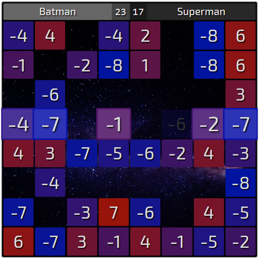

# Minus8

A simple turn-based game inspired by old J2ME game MAX8 by MobiLeap. With online/offline multiplayer capabilities.
Made with vue.js (front), express.js (back), websockets (in between).



## Rules

- Board is filled with cells with various score values.
- Game is turn-based. One player can move only horizontally and the other - vertically.
- On each turn, player should choose one cell from active row.
  First player (and first row/column) is determined randomly.
- After choosing cell, it's score value is added to current player score and turn goes to next player.
- Game finishes when there is no cells available in active row/column.
- Goal is to have score better than your opponent at the finish of the game.

## Build Setup

```bash
# install dependencies
npm install

# serve with hot reload at localhost:8080
npm run dev

# server on localhost:80
npm run dev-server

# build for production with minification
npm run build
```
